# PanoSim-Autoware 联合仿真
本章节介绍 PanoSim-Autoware 联合仿真的实现。

- [PanoSim-Autoware 联合仿真](#panosim-autoware-联合仿真)
  - [1. PanoSim-Autoware 必要环境](#1-panosim-autoware-必要环境)
    - [1.1 硬件环境](#11-硬件环境)
    - [1.2 软件环境](#12-软件环境)
    - [1.3 软件架构](#13-软件架构)
  - [2. ROS2 Bridge](#2-ros2-bridge)
    - [2.1 完成 ROS2 Bridge 环境部署](#21-完成-ros2-bridge-环境部署)
    - [2.2 脚本拷贝](#22-脚本拷贝)
    - [2.3 测试](#23-测试)
  - [3. PanoSim 安装配置](#3-panosim-安装配置)
    - [3.1 完成 PanoSim 相关安装配置](#31-完成-panosim-相关安装配置)
    - [3.2 测试](#32-测试)
  - [4. Autoware 配置](#4-autoware-配置)
    - [4.1 完成 Autoware 相关配置](#41-完成-autoware-相关配置)
    - [4.2 测试](#42-测试)
  - [5. 联合仿真](#5-联合仿真)
    - [5.1 启动 Autoware SimulatedClockPanel ( Ubuntu 22.04 )](#51-启动-autoware-simulatedclockpanel--ubuntu-2204-)
    - [5.2 启动 ROS2 Bridge](#52-启动-ros2-bridge)
    - [5.3 启动 PanoSim](#53-启动-panosim)
    - [5.4 启动 Autoware](#54-启动-autoware)
    - [5.5 运行效果](#55-运行效果)

## 1. PanoSim-Autoware 必要环境
### 1.1 硬件环境
硬件需求：
运行此项目，需要至少两台电脑：一台运行 PanoSim ，一台运行 Autoware。

|             | PanoSim | Autoware     |
| :----:       |    :----:   |    :----: |
| 系统      | Windows 10 / Windows 11       | Ubuntu 22.04  |
| 软件版本   | v32.8        | v1.0      |
|显示器|-|-|
|处理器|Intel i7 或同级别处理器|Intel i7 或同级别处理器|
|硬盘|512GB+1TB|512GB+1TB|
|内存|32G|32G|
|显卡|NVIDIA RTX 4070|NVIDIA RTX 4070|
### 1.2 软件环境
[panosim-autoware](https://gitee.com/wobuzhuchele/panosim-autoware/tree/master) 含联合仿真所需的通讯脚本、地图资源以及 Autoware 代码。

### 1.3 软件架构
1.3.1 SIL
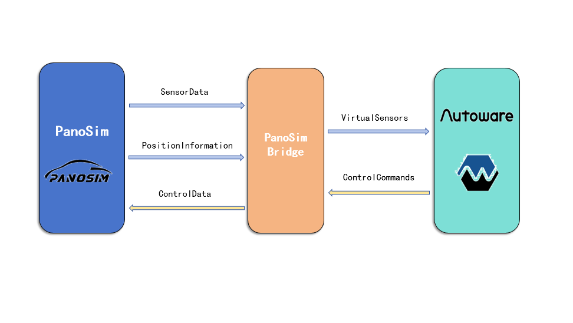
1.3.2 VIL

## 2. ROS2 Bridge 
### 2.1 完成 ROS2 Bridge 环境部署
[ROS2 Bridge](./ROS2%20Bridge.md)
### 2.2 脚本拷贝
- 将 `panosim-autoware/Autoware_Bridge` 下的脚本拷贝到 ROS2 Bridge 安装路径的 src 下
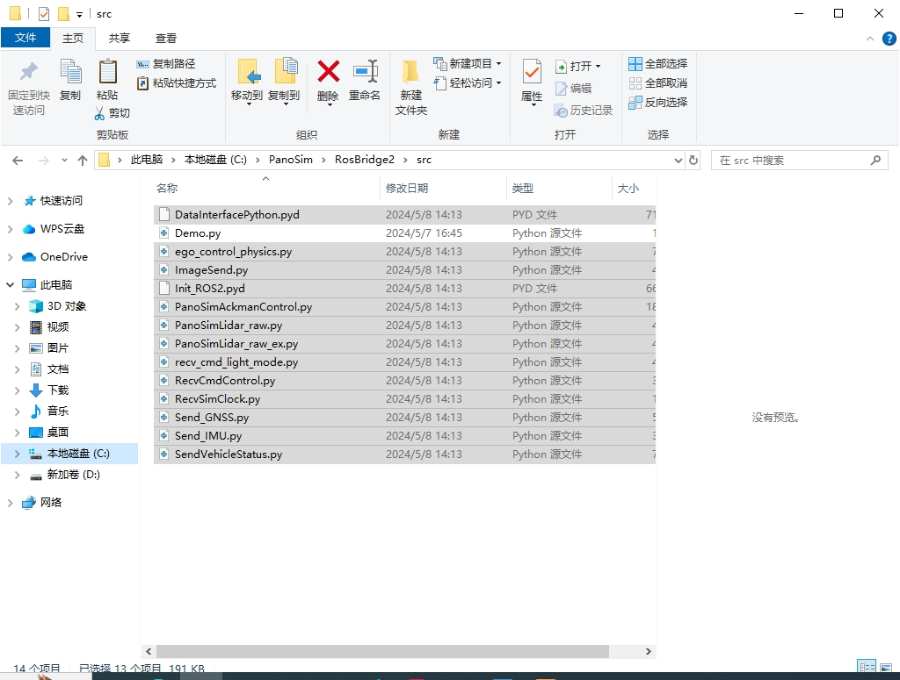
### 2.3 测试
<video controls src="image/PanoSim-Autoware/Autoware-2024-05-17_18.27.10.mp4" title="Title"></video>
## 3. PanoSim 安装配置
### 3.1 完成 PanoSim 相关安装配置
[PanoSim-Autoware PanoSim 配置](./PanoSim-Autoware%20PanoSim%20配置.md)
### 3.2 测试
- 打开软件

- 选择实验并启动实验

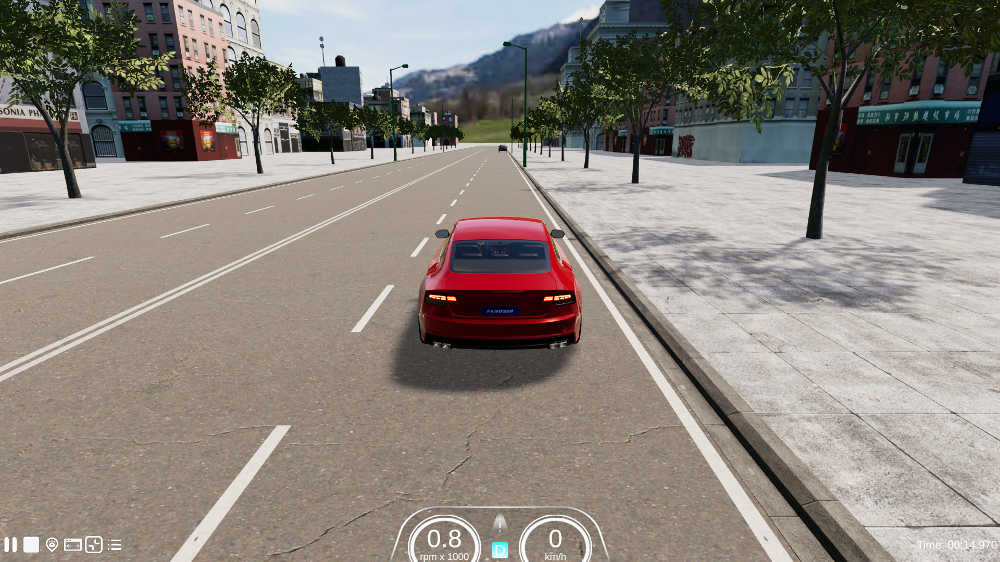

## 4. Autoware 配置
### 4.1 完成 Autoware 相关配置
[PanoSim-Autoware Autoware 配置](./PanoSim-Autoware%20Autoware%20配置.md)
### 4.2 测试 
- 加载地图和功能模块
  ```
  source install/setup.bash
  ros2 launch Autoware_launch planning_simulator.launch.xml map_path:=$HOME/Autoware_map/sample-map-planning vehicle_model:=sample_vehicle sensor_model:=sample_sensor_kit

  ```
  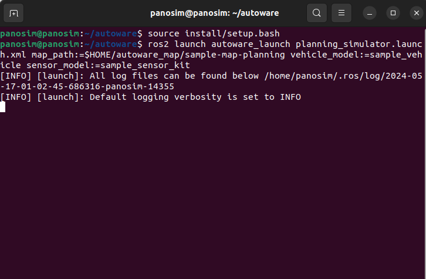
- 放置车辆
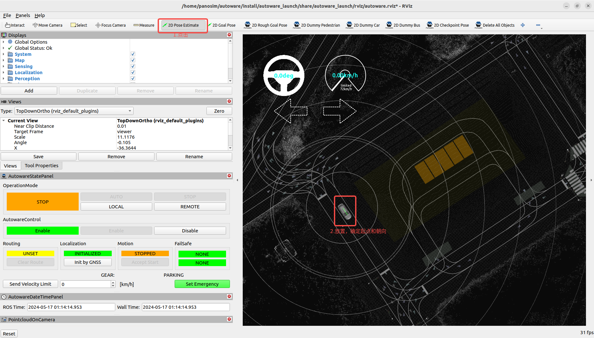
- 规划行使路径
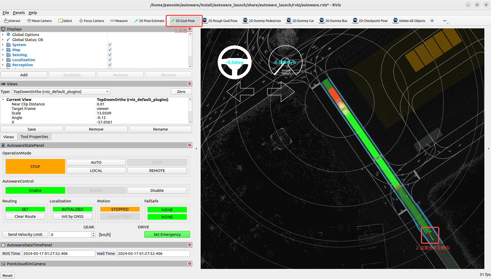
- 启动自动行驶
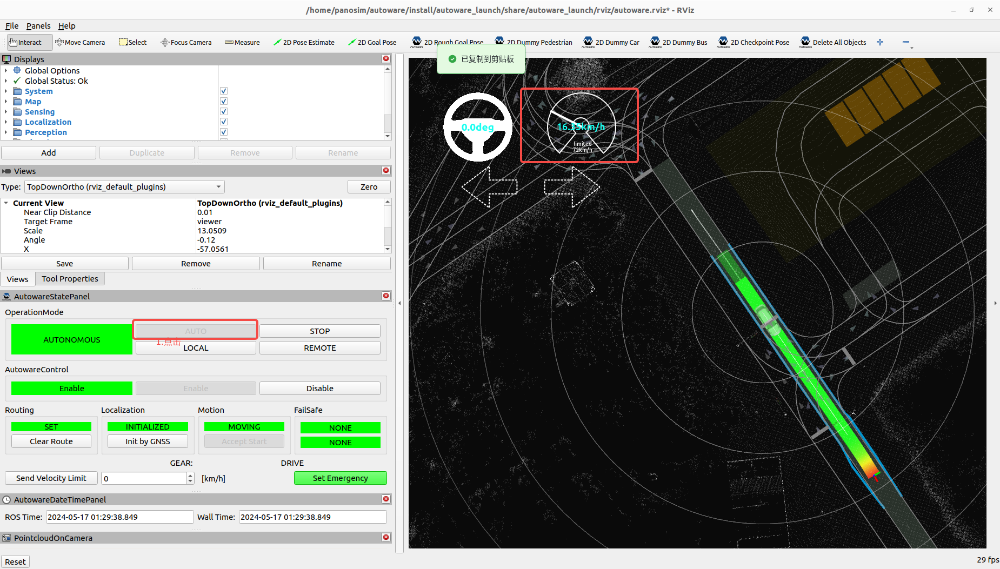

## 5. 联合仿真
### 5.1 启动 Autoware SimulatedClockPanel ( Ubuntu 22.04 )
- `Ctrl + Alt + T`弹出窗口并输入：
  ```
  cd ~/Autoware
  source install/setup.bash
  rviz2
  ```
- rviz2 运行界面

- 点击 `Panels` ，点击 `Add New Panel` ，添加 `SCimulatedlockPanel`
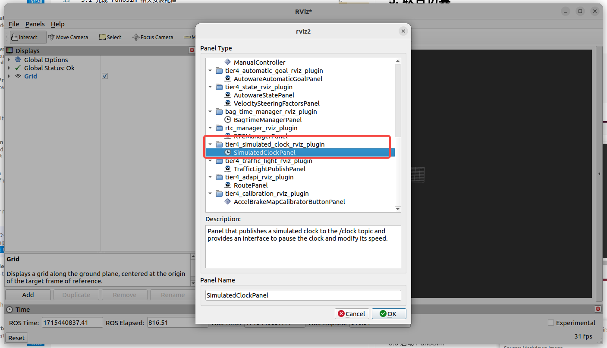
- 查看是否添加成功
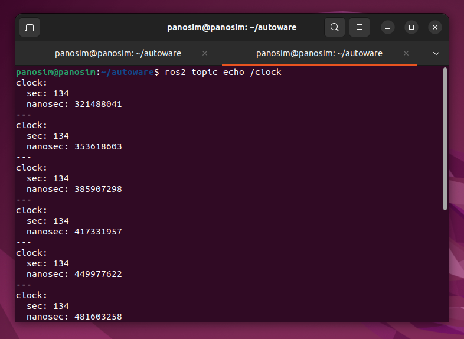
### 5.2 启动 ROS2 Bridge
- 启动 `RecvSimClock.py` 用于接受仿真时间
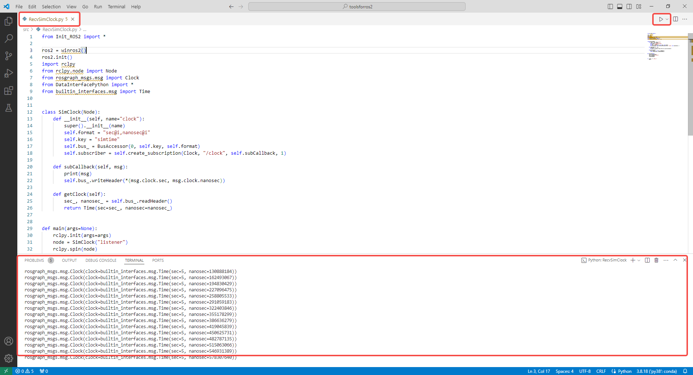
- 启动其他脚本

### 5.3 启动 PanoSim
- 打开软件
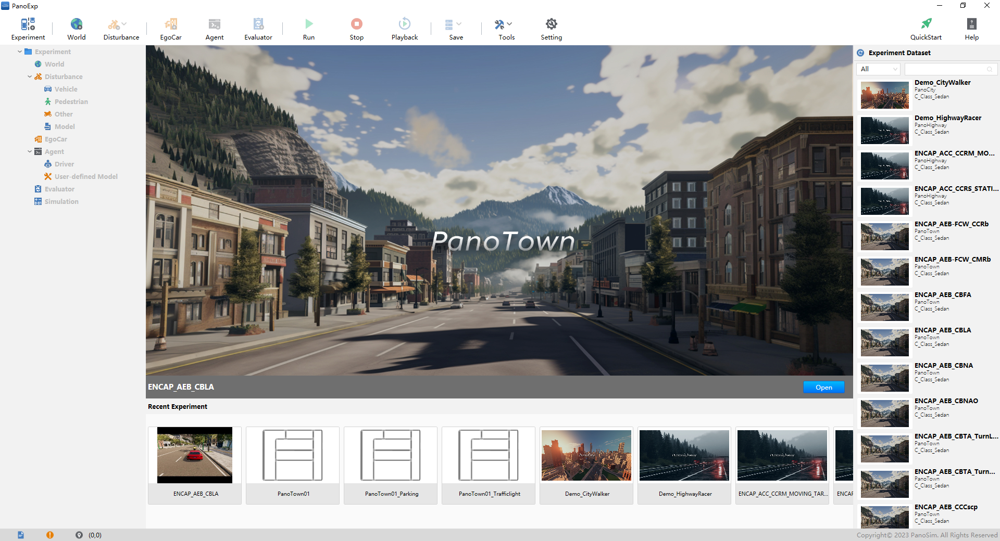
- 选择实验并启动实验
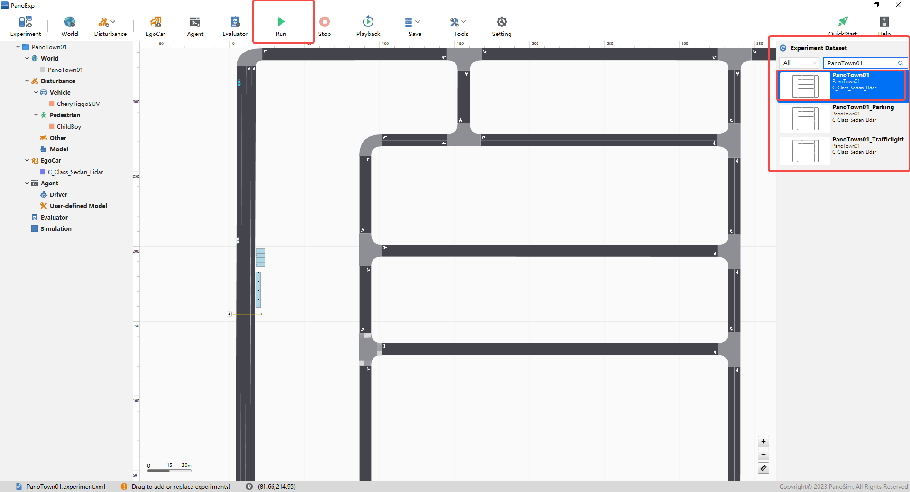

  
### 5.4 启动 Autoware
- 启动 e2e_simulator
  ```
  source ~/Autoware/install/setup.bash
  ros2 launch Autoware_launch e2e_simulator.launch.xml map_path:=$HOME/Autoware_map/PanoTown01 vehicle_model:=sample_vehicle sensor_model:=sample_sensor_kit
  ```
- 运行界面
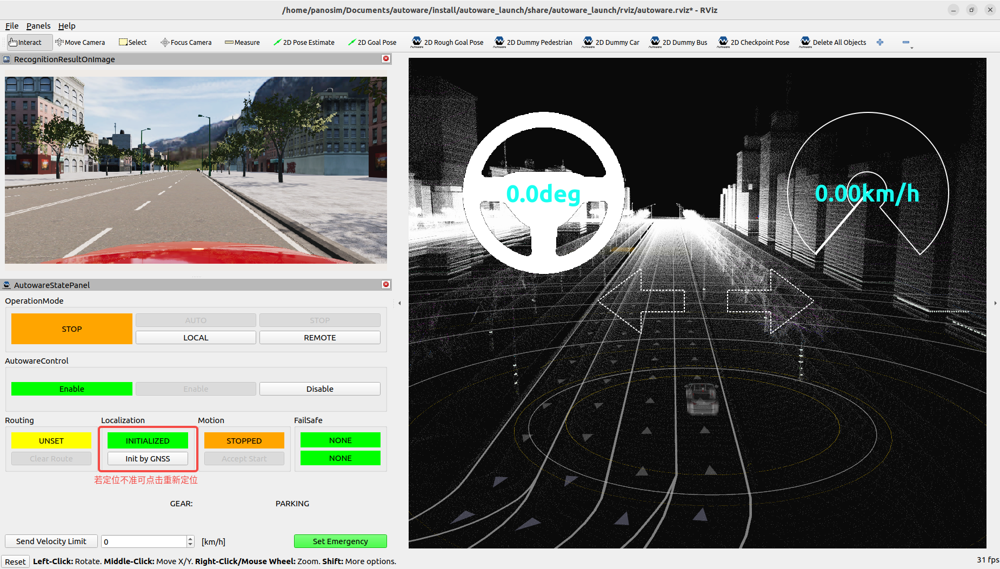
### 5.5 运行效果

<video id="video" controls="" preload="none">
    <source id="mp4" src="image/PanoSim-Autoware/Autoware-2024-05-17_17.46.53.mp4" type="video/mp4">
</video>
