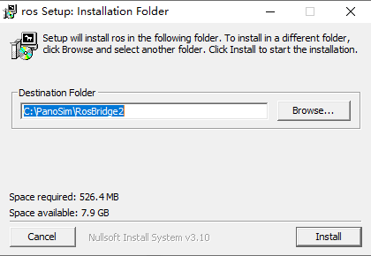
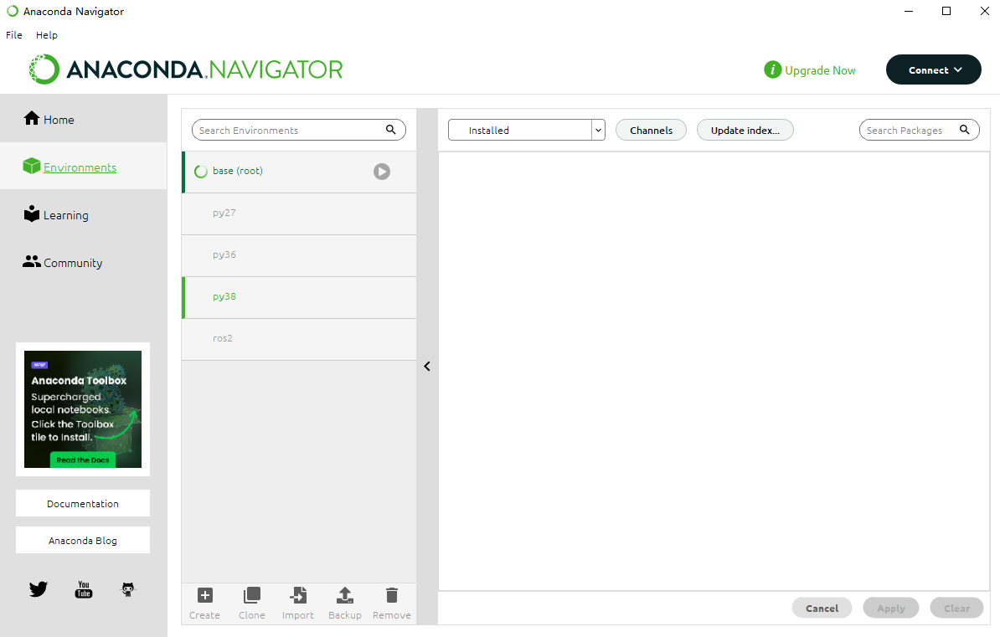
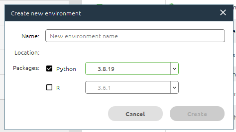
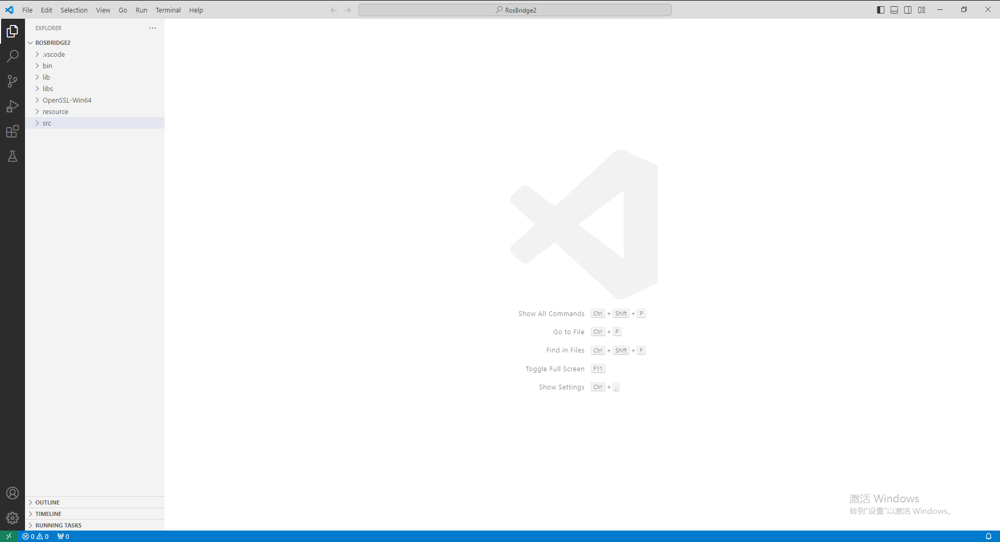
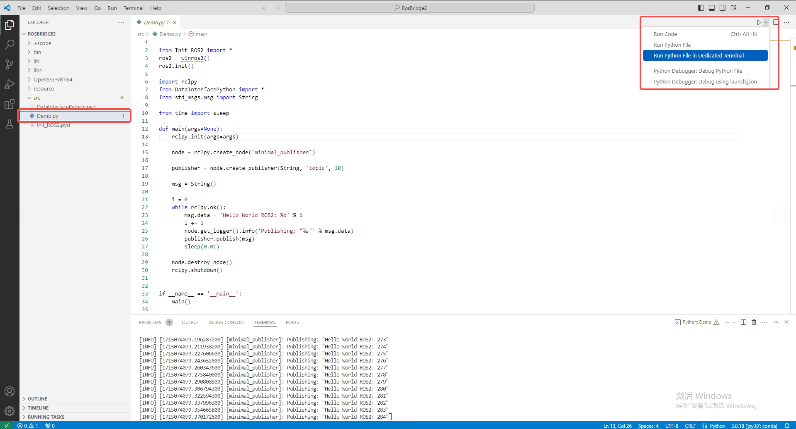
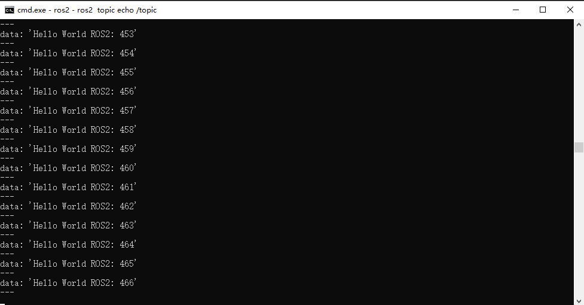
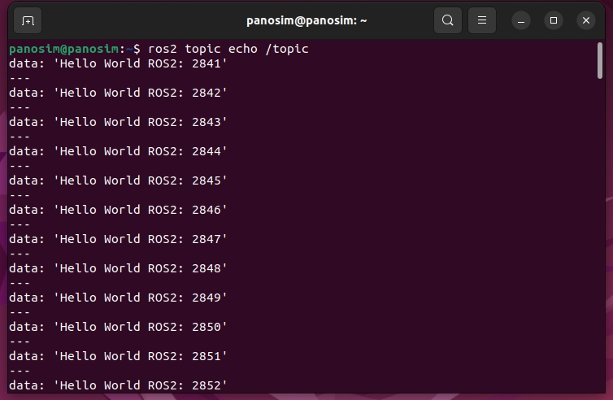

# ROS bridge 安装 （ROS2）
本章节提供一种方式构建PanoSim与ROS2环境的通讯
- [ROS bridge 安装 （ROS2）](#ros-bridge-安装-ros2)
  - [1.必要文件](#1必要文件)
  - [2.环境部署](#2环境部署)
    - [1. 安装 ROS2 环境必需文件](#1-安装-ros2-环境必需文件)
    - [2. 正常安装 anaconda(已安装,可跳过)](#2-正常安装-anaconda已安装可跳过)
    - [3. 使用 anaconda 安装 ROS2 所需 Python38 环境](#3-使用-anaconda-安装-ros2-所需-python38-环境)
  - [3.运行脚本](#3运行脚本)
    - [1. 创建环境](#1-创建环境)
    - [2. 打开工作空间](#2-打开工作空间)
    - [3. 测试](#3-测试)
  - [4.查看运行结果](#4查看运行结果)
    - [1. Windows ROS2](#1-windows-ros2)
    - [2. Ubuntu ROS2](#2-ubuntu-ros2)

## 1.必要文件
* [ROS2 环境必需文件](https://pan.baidu.com/s/1FltAHoF6KvzDM495mICMcw?pwd=ye1i)
* [anaconda](https://mirrors.tuna.tsinghua.edu.cn/anaconda/archive/)
* [vscode](https://code.visualstudio.com/docs/?dv=win64user)

## 2.环境部署
### 1. 安装 ROS2 环境必需文件
- 双击 `ros2_pack.exe` 选择路径进行安装如 `C:\PanoSim\RosBridge2`

### 2. 正常安装 anaconda(已安装,可跳过)
- [中文教程](https://anaconda.org.cn/anaconda/install/windows/)
### 3. 使用 anaconda 安装 ROS2 所需 Python38 环境
- 点击 `Environment` 

- 点击 `Create` 创建 Python 环境，环境名称自行填写如 `py38`

## 3.运行脚本
### 1. 创建环境 
- 使用 anaconda 选择创建的 Python38 环境并打开 vscode

### 2. 打开工作空间
- 使用 vscode 打开安装 ROS2 环境所在文件夹

### 3. 测试 
- 选择 ` demo.py ` 并运行  

## 4.查看运行结果
### 1. Windows ROS2

### 2. Ubuntu ROS2

>[跳转到 PanoSim-Autoware](./PanoSim-Autoware.md)
